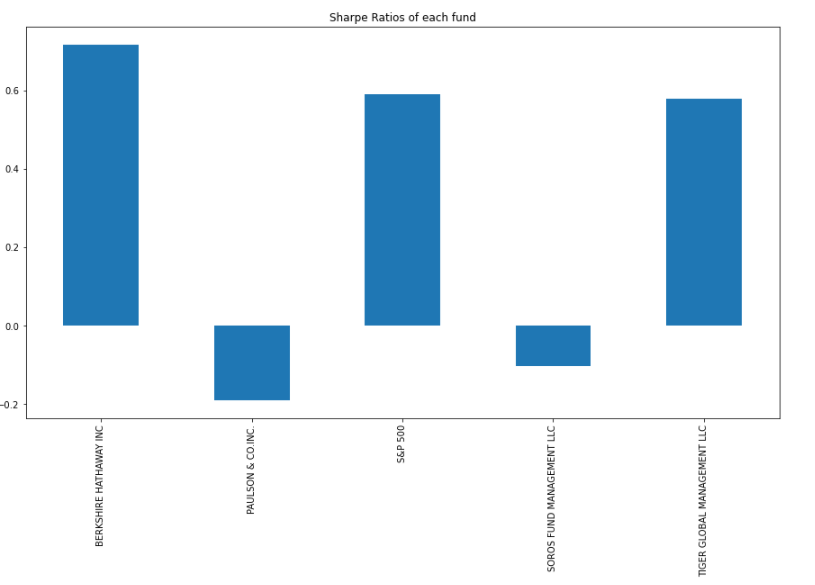

# Challenge4

In this challenge we were asked to determine which investment portfolio is better for our clients. In this task, the four investment options have been reviewed and a detemination of the best investment is determined. Using key risk management metrics, the daily returns, standard deviation and Sharpe ratios as well as betas, we have determined that the berkshire hatahway fund is the best portflio to include in the clients funds. Methods of how this was determined is addressed below. 

# Findings

