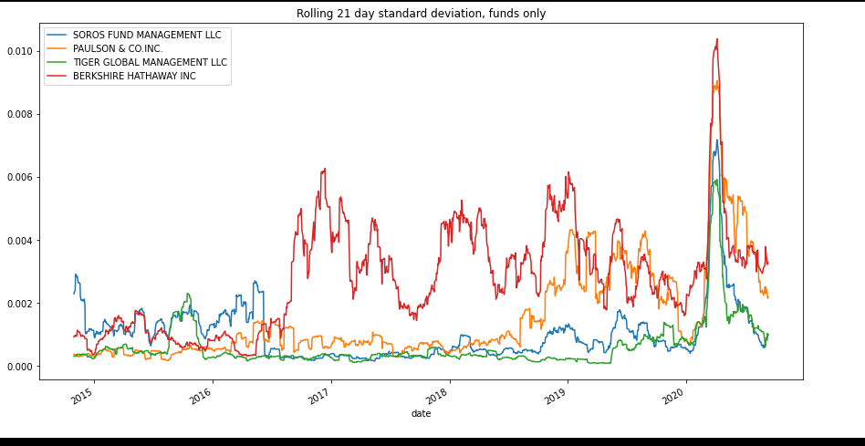

# Challenge4

In this challenge we were asked to determine which investment portfolio is better for our clients. In this task, the four investment options have been reviewed and a detemination of the best investment is determined. Using key risk management metrics such as the daily returns, standard deviation, Sharpe ratios as well as betas, we have determined that the berkshire hatahway fund is the best portflio to include in the clients funds. Methods of how this was determined is addressed below. 

# How to Run

In the starter code program open the python code *risk_return_analysis-checkpoint.ipynb* in either juypter lab or vs code with the juypter lab extension.

Figures and graphs are adjusted for ease of viewing

Answers to questions are in the code, but will also be in the **Findings** section below

# Findings

The first set of analysis required was to determine, via visualtionm if any of the four funds actually outperforms the S&P 500. Fir the time fram given to us, we actually see that in recent years the S&P 500 actually out performs all the other funds. 

Next we need to determine which of the four funds is the most volatile. I was able to determine which was most volatile visually, by displaying the four fund returns in a box plot. This showed that the berkshire has the widest distribution of returns, hence is the most volatile. 

Since, we are interested in adding the fund to our portfolio we needed to look at annulaized metrics. It was determined that non of the funds have more risk than the S&P 500. Based on the rolling metrics, it was also determined that the risk of the portfolios all increases at around the same time, albeit the degree of the increases varies with eachg fund and portfolio. This indicates that there is little diversification in these portfolios. 
Lastly, based on the data the Soros fund had the highest risk until mid 2016, when Berkshire hathaway overtook it and was the most volatile fund until 2019. In 2019 we observe that Paulson & co overtook berkshire as the volatile fund, but the pattern reverts back to berkshire throughout the year, until Berkshire became the most volatile fund in early 2020, with Paulson & co trailing. Then Paulson overtook Berkshire for a brief period and the volatility dropped significantly over the end of 2020 and Bertkshire remains the most volatile fund.

From all of this data, as well as the beta, it was determined that berkshire hathaway has the best risk return.

In conclusion, the Berkshire fund beats the other funds on a return as well risk adjusted basis. In addition, on a risk adjusted case the Berkshire fund also beats the S&P500

